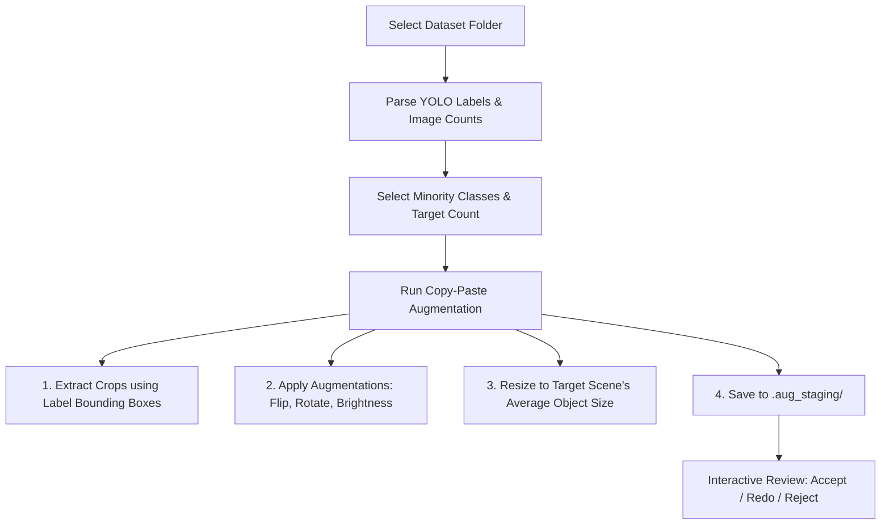

# Dataset Copy-Paste Augmenter

An interactive, high-fidelity offline dataset balancing tool designed specifically for object detection models (YOLO format). This application helps solve class imbalance problems by selectively extracting minority class instances, augmenting them, and blending them organically onto background images with an interactive review pipeline.

---

## 🎯 Purpose

In object detection tasks (like YOLOv8/v11), dataset class imbalance severely harms model performance on rare classes. 

This tool provides an **offline, high-fidelity dataset balancing solution**:
1. **Interactive Class Balancing:** Select specific minority classes and set target instance counts per class.
2. **Context-Aware Pasting:** Automatically extracts the exact cropped objects using existing label annotations.
3. **Organic Blending:** Scales, flips, slightly rotates, and adjusts brightness so that the pasted crops organically match the target background images.
4. **Staged Safety:** Saves all generated images to a temporary review zone (`.aug_staging/`) before permanently committing them to your training set.

---

## ⚙️ How It Works



### 1. Object Extraction (Crops)
The tool parses your dataset's YOLO label files. When a minority class instance is found, it extracts that region of interest from the image to act as a source crop.

### 2. Random Crop Augmentations
Before pasting, the extracted crop undergoes organic, randomized changes:
- **Random Horizontal Flip:** $50\%$ chance of mirroring.
- **Random Brightness:** Scales crop brightness in HSV space by a random factor between $0.8$ and $1.2$ to match various background exposures.
- **Random Slight Rotation:** Rotates the crop between $-15^\circ$ and $+15^\circ$, dynamically expanding the crop canvas to prevent cutting off corners.

### 3. Smart Scaling
Crops are resized dynamically to match the **average size of all annotated objects** in the target background image, preventing pasted objects from looking unnaturally large or microscopically small.

### 4. Interactive Review Pipeline (Staging)
Generated images and labels are placed inside a hidden `.aug_staging/` folder for inspection before committing:
- **Accept Image:** Moves the currently selected staged image and its updated `.txt` label file directly into your real `images/` and `labels/` folders.
- **Redo Image:** Deletes the staged image and instantly generates a new composite in-place (selecting a fresh random crop/background and applying new augmentations).
- **Accept All Staged:** Commits all staged augmented images in bulk and cleans up the staging folder.
- **Reject All Staged:** Wipes the staging folder, discarding the batch, and resets the interface.

---

## 🚀 Getting Started

### Installation
1. Clone the repository:
   ```bash
   git clone https://github.com/akerues/copy-paste-augmentation.git
   cd copy-paste-augmentation
   ```
2. Set up a virtual environment and install dependencies:
   ```bash
   python3 -m venv .aug
   source .aug/bin/activate
   pip install -r requirements.txt
   ```

### Running the App
Start the PyQt interactive dashboard:
```bash
python main.py
```

---

## 📦 Building Standalone Installers

### For Linux Ubuntu (BitRock InstallBuilder)
1. **Compile your executable:**
   ```bash
   pyinstaller --noconsole --name "DatasetCopyPasteAugmenter" main.py
   ```
2. **Build the installer:**
   - Open **BitRock InstallBuilder** on your Linux machine.
   - Open [installbuilder.xml](installbuilder.xml).
   - Click **Build** to output a self-contained Linux `.run` installer!
   - Run the installer in Ubuntu:
     ```bash
     chmod +x datasetcopypasteaugmenter-1.0.0-linux-x64-installer.run
     ./datasetcopypasteaugmenter-1.0.0-linux-x64-installer.run
     ```

### For Windows (Inno Setup)
1. **Compile your executable:**
   ```bash
   pyinstaller --noconsole --name "DatasetCopyPasteAugmenter" main.py
   ```
2. **Build the installer:**
   - Open **Inno Setup** in Windows.
   - Load [setup.iss](setup.iss) and click **Compile** to output a single Windows Setup `.exe` file!